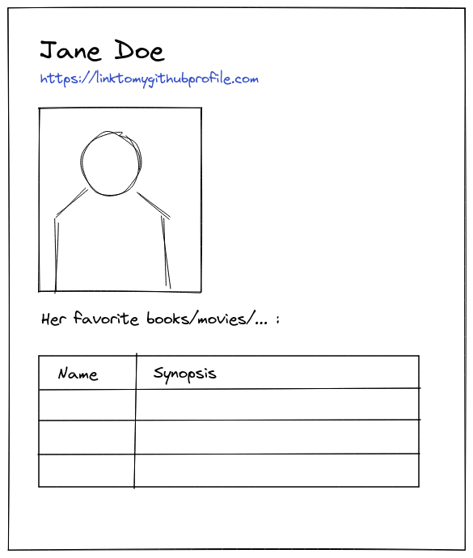

# Markdown introduction

Markdown is an easy way to create documents using `code`. Although very simple, this format will allow you to create readmes for your future repositories.

Type of challenge: **learning**  
Duration: **1 hour**  
Team challenge: **team of two**

## Learning objectives

At the end of this challenge you should be able to:
* Create beautiful markdown documents

## Requirements

This briefing assumes that you know how to:

- Use a text editor
- Use the terminal

## The mission

Your goal will be to create a small markdown document that describes you

- Using the terminal create a new folder called `git-training`
- Using the terminal create a new file called `readme.md`
- Inside that document create a title with your name
- Put a link to your Github profile as a subtitle
- Put an image that best represents you (could be either a picture of you or a picture of your liking)
- Make a table containing 5 favorite books (or movies or series or whatever)

The document should look like this:

Once this is done, **keep that file** because you will need it for the next step!

## Resources

- There are online editors that help you visualise markdown, [this one is great](https://stackedit.io/app)
- You can preview markdown directly in your IDE (for instance in VSCode)