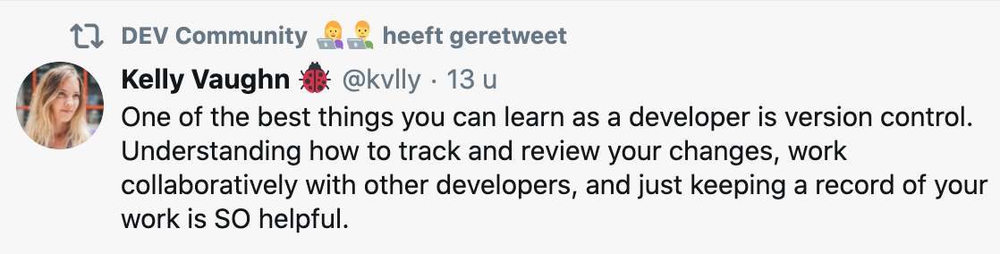

# Git & Github

## What are they?

**Git** is a version control system. It is a necessary tool for every self-respecting developer. It enables you to log every change within a project in detail and to work together in the same file at the same time.

**GitHub** is an online platform _made on top of_ Git. It gives you an online interface that has the same features as Git.
It also serves as a place to put your code. It is one of the biggest online developer community.

## Next steps

1. [Install Git](./1.Installing-Git.md)
1. [Configure Git](./2.Configure-Git.md)

## Documentation and useful stuff

_Read this if you feel like it, or if you are lost. Bookmark it for the future._

- [A very complete video series on Git](https://www.youtube.com/playlist?list=PLRqwX-V7Uu6ZF9C0YMKuns9sLDzK6zoiV)
- [Manual](https://try.github.io/)
- [Git CheatSheet](https://education.github.com/git-cheat-sheet-education.pdf)
- [Collection of Git tips](https://github.com/git-tips/tips)
- [Git Pro Book](http://git-scm.com/book/en/v2) (Very complete and in-depth, but also challenging)
- [Pluralsight - Mastering Git](https://www.pluralsight.com/courses/mastering-git) (You can use the free trial)
- [Codecademy - Learn Git](https://www.codecademy.com/courses/learn-git/lessons/git-workflow/exercises/hello-git) (Needs a free account)
