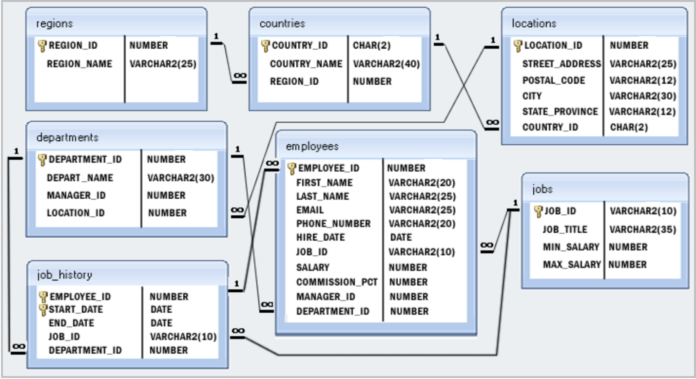

# Intro to relational databases and schemas

## Practical Information

- Repository: `no repository`
- Deadline: 1 day

## Learning Objectives

- Model a simple relational DB model
- Perform CRUD operations on a Database

## Exercise

Today, you will use SQL queries to another extent.
Provided with this README, is a file called [database](./database), you will train to create sql queries using that file!

To help you, here is the db schema of said table.



You will use sqlite that you installed yesterday.

You will learn a lot of new things so keep calm and tackle one challenge at the time!

You can do it!

## Challenges

To start, use your terminal to navigate into the folder where you cloned the file database, and run :

```
sqlite3 database
```

### SELECT

1. Write a query to display the names (first_name, last_name) of all the employees.

2. Write a query to get all employee details and order them by first name, descending.

3. Write a query to get the total salaries payable to employees.

4. Write a query to get the maximum and minimum salary from employees table.

5. Write a query to get monthly salary (round 2 decimal places) of each and every employee. To get the monthly salary of an employee, divide the annual salary by `12,2`

### Restricting and Sorting Data

6. Write a query to display the names (first_name, last_name) and salary for all employees whose salary is not in the range $10,000 through $15,000

7. Write a query to display the names (first_name, last_name) and salary for all employees whose salary is not in the range $10,000 through $15,000 and are in department 30 or 100.

8. Write a query to display the last names of employees having 'e' as the third character.

### Aggregate Functions and Group by

9. Write a query to list the number of jobs available in the employees table.

10. Write a query to get the department ID and the total salary payable in each department.

11. Write a query to get the average salary for each job ID excluding programmer.

12. Write a query to get the average salary for all departments employing more than 10 employees.

### Subquery

13. Write a query to find the names (first_name, last_name) and salaries of the employees who have a higher salary than the employee whose last_name='Bull'.

14. Write a query to find the names (first_name, last_name) of the employees who have a manager who works for a department based in the United States.

Hint : Write single-row and multiple-row subqueries

### JOINS

15. Write a query to find the names (first_name, last name), department ID and the name of all the employees.

16. Write a query to to display job title, employee name, and the difference between the salary of the employee and minimum salary for the job.

Good luck everybody!


