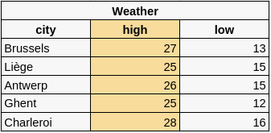

# Databases

## Why databases ?

Imagine you have a web server and you want to store information permanently.

You can use multiple material a `.txt` file, a `.doc` file, an Excel sheet, a `.json` file ect...

On a web server, with this kind of material you must open it, then read or write it, then close it and again and again, each time you want to update it.

Take the example of a todolist:

- **Problem 1: if the number of simultaneous accesses increases**: imagine that a todolist is used by 200 people at the same time: when a task is added to the list (therefore to a `json` file) the process launched by the first user monopolizes the file: the 199 other processes (corresponding to the other users) must wait, each in turn, for the file to be released by the current process. A bit like at the butcher's shop, or at the Post Office.

- Consequently, it is a safe bet that beyond five or six simultaneous users, this creates such latency that other users receive "time out" errors (meaning that the HTTP request is irrelevant). of a valid answer).

- **Problem 2: if the content increased**: as the task list increased, the file swells in weight (kilobytes). The operation of opening, writing, closing the file will therefore be slower and slower.

Faced with these limitations, the current solution is to associate our backend with another server: a database server (for example a SQL server). Its role is precise: to store data, and to allow interaction with this data by serving it very (very) quickly to the backend, which minimizes the risk of "timeout".

_For the record, it goes very fast because the SQL server puts the data in the RAM of the computer hosting the server. And what does RAM mean? Yep: "Rapid Access Memory". Since it is in memory, no need to open or close files on a typically slower hard drive._

## DBMS (Database Management Systems)

There are many software programs that allow you to manipulate databases, called "database management engines. In English and in short: DBMS.

For the web, we mainly use these :

- MySQL (and its recommended version: MariaDB)
- SQLite
- PostgreSQL

SQL being very popular and present on 99.99% of the hosts, it is it that we will use during this sequence. What is cool is that language to interact with MySQL, which is also used by other DBMS. so what you learn with MySQL can be transposed easily if you had to use another one.

## What does a database look like?

A **database** is actually just a group of one or more tables containing... data. Much like an Excel table or Google sheets. Here is a database containing only one table : "weather"

In this example, the **table** "weather" contains the data ant to present the weather forecasts for major Belgian cities (minimum and maximum temperature).

Each city has its own **row**.  

Each row (therefore, here, city) is described by as many **columns** as necessary by the application.  

**Make sure that at this stage, you understand and know how to use these terms wisely: _database_, _table_, _row_ , _column_.**

## CRUD

We have to familiarize yourself with SQL syntax so that you can become a sucesful web developer.

Your application will perform essentially 4 types of operation, which are summarized by "**CRUD**", in other words:

1. **C**reate: add a row or a table to your DB.
2. **R**ead: select one or more cells, rows, tables (to display them for example).
3. **U**pdate: modify the information stored in a row.
4. **D**elete: delete a row.

## Exercises:

1. [Database design](./1.Design.md)
1. [Using SQL](./2.Queries.md)
1. [More queries](./3.MoreQueries.md)
