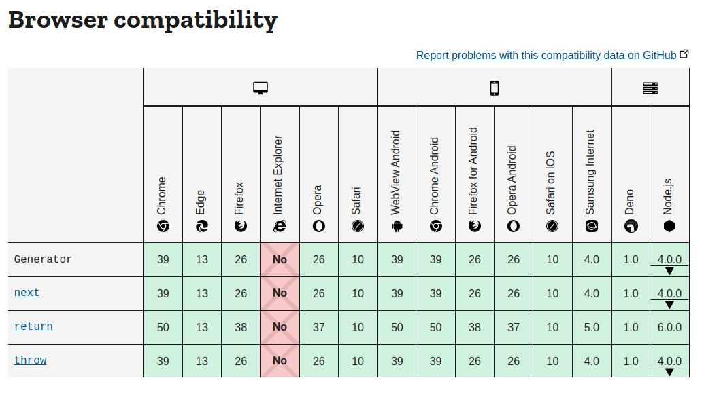
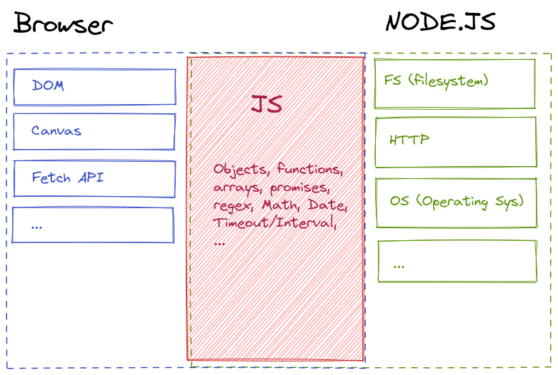

# Getting Started

## What is Node.js ?

Node JS is an open-source JavaScript tool built on Google Chrome’s JavaScript Engine. **It is not a language**, it is Javascript that is executed outside the browser, thus allowing to write server-side code.

When we say that something is written in Node.js, we simply mean that the javascript code is not meant to be run inside an HTML document but rather be executed by the Node.js interpreter.

Beside backend application, some popular tools are written using Node.js (using the Electron framework) such as messaging clients (Discord, WhatsApp, Slack), desktop applications (Visual Studio Code, Figma, ...) and also development tools like the Babbel transpiler (used to translate an input language to Javascript) and many, many more...

## So it's just Javascript? What is the difference with the JS "we already know"?

Node.js and "browser JS" are technically the same thing. These are two interpreter working with the same base language. Not so long ago each browser had their own implementation of the Javascript language, making it hard for developers to keep up. Thankfully those harsh times are almost gone now, but we can still see remnants of these differences on documentation websites such as MDN.

The key difference of Node.js though is that it has no graphical interface, there is no need for a DOM library for instance, since we won't be working with displays. On the other hand, we'll need functions to work with files and databases on our server, hence needing special functions on the backend and that's what Node.js provides.

In summary, Node.js is a terminal based Javascript interpreter with additional functions to work on server-side logic. The browser specific functions have been removed from the Node interpreter. To know if a function is part of the Javascript base language, browser specific or Node.js it is important to know where to find documentation.

- [The list of Browser specific functions on MDN](https://developer.mozilla.org/en-US/docs/Web/API)
- [The list of Node.js base modules](https://nodejs.org/dist/latest-v16.x/docs/api/)

When in doubt, you can always check the compatibility table at the bottom of MDN web docs to see whether that function is implemented in the browser and/or in Node.js.

## What's next?

**Let's jump into the nodeverse to [setup Node and run our first application!](../2.Our-First-App/)**

