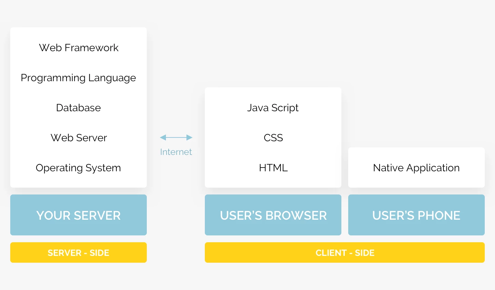

# Fullstack sprint

A tech stack refers to a set of tools, programming languages, and technologies that work together to build digital products or solutions such as websites, mobile, and web apps.

It consists of two equally important elements: the frontend (client-side) and backend (server-side). Both work together to create a working tech stack. This is also referred to as an application stack.

We already know a bit about the frontend which is made of HTML, CSS and Javascript, so let's dive into the unknown part.

## The backend stack

Our backend stack will require a few components to be up and running:

- A language to execute the backend code. It could be anything, most popular options are: PHP, Javascript (Node.js), Java, Ruby, C# (.NET)
- A way to store the data, known as a **database**:
  - Relationnal databases (SQL family), such as MySQL, PostgreSQL, SQLite, ...
  - Document based, such as MongoDB
- Most people use **frameworks**, pieces of reusable code written in the language that they use, to help them structure their codebase such as Laravel (PHP), Ruby on Rails (Ruby), Express / Next.js (Javascript), Spring (Java),
- Some languages (such as PHP) also require a web server to work, but for others this is not necessary.
- Finally you will need a **server**, a machine that is connected to the internet with its own operating system. We can work on our own computer that acts as a server when developing. When we deem the code ready we will push the code on a remote server, a **host**, this process is known as **deployment**.

## Exploring the stack

- [Database](./1.Database/)
  - [Design a database](./1.Database/1.Design.md)
  - [Using SQL](./1.Database/2.Queries.md)
  - [Query Drill](./1.Database/3.MoreQueries.md)
- [Using js as a backend language](./2.Node/)
