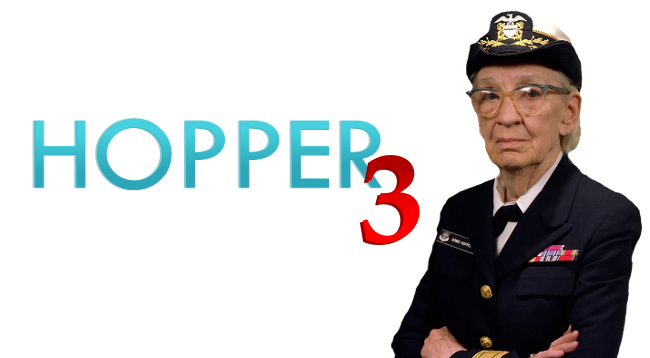

# Hopper 3 - (29/03/2022->14/10/2022)

This repo is your go-to place for all information on your activities at BeCode: briefings, tutorials, etc.  
Clone it on your computer and `git pull` regularly in order to fetch the latest updates made by your coaches.

---

- [What are we going to do ?](#Whatarewegoingtodo)
- [🛠️ Tools and Resources](#ToolsandResources)
- [🕑 Respect for planning: being late & absence](#Respectforplanningbeinglateabsence)
- [📅 Agenda](#Agenda)
- [🌴 Vacation and holidays](#Vacationandholidays)
- [⚖️ Rules](#Rules)

---

## 1. What are we going to do ?

### 🌱 The field

- IDE & terminal: your tools of trade
- Git: working in development teams
- Markdown
- HTML/CSS: Layout for the web
- Algorithmics basics: Your first programming experience

### 🏕️ The hill

- JavaScript (JS): The frontend programming language
- Fullstack Sprint: The main building blocks of a web application

### ⛰️ The mountain

- The backend path
  - Databases
  - Routing
  - CRUD
  - Object Oriented Programming
  - MVC patterns
- The frontend path
  - Design primers
  - CSS frameworks
  - Javascript frameworks

### 🚠 Summer pastures

- Diving deeper in your technology of interest
- Bigger projects
- Sharing knowledge
- Preparing for internship

Your contacts at BeCode:

| Role            | Name                                                              |
| --------------- | ----------------------------------------------------------------- |
| Lead Coach      | [Kelian "Killou" Christophe](mailto:kelian.christophe@becode.org) |
| Secondary Coach | [Michel Plainchamp](mailto:michel.plainchamp@becode.org)          |
| Career Coach    | [Sophia Cupaiolo](mailto:sophia@becode.org)                       |

## 2. 🛠️ Tools and Resources

- [More info on the tech talks](./Extra-Info/Tech-Talks.md)
- [Extra Info](./Extra-Info)
  - How to write a README
  - How to Google things
  - What IDE (= editor) to use

## 3. 🕑 Respect for planning: being late & absence

In case of **delay**, **absence** or **early leave** (planned or not), you will need to warn us.

In short here is what you do in any of the three cases above:

1. Send a message to _all_ your coach(es) by mail (and perhaps Discord too)
2. Warn BeCode through [my.becode.org](https://my.becode.org/):
   - If you already have some note to justify your absence (eg. a doctor's note), then send this straight to us using the platform (my.becode.org);
   - If you know that you are going to obtain such document, tell us when you notify us of your absence. Once you have the document, send it to us through the platform;
   - When you know that you will have no legal reason for the absence or delay then please let us know <abbr title="As Soon As Possible">ASAP</abbr> as well on Discord. Not showing up or showing up late is considered unprofessional.

---

- 2 unjustified occasions of being late or leaving early is seen as an absence
- 2 unjustified absences leads to a one-on-one conversation
- 6 unjustified absences leads to a termination of your contract with us {and the vdab} and results in you leaving this training permanently.
- If the absence rate (justified or not) exceeds 20%, BeCode may decide on the final exclusion of the learner.

## 4. 📅 Agenda

To keep up to date with the upcoming events, workshops and hackathons remember to check the **BeCode Global Discord server #events channel**!

## 5. 🌴 Vacation and holidays

There are **2 vacation blocks of one week** as well as several public holidays.

| Dates              | What are we doin'?  |
| ------------------ | ------------------- |
| 18/04              | Planned vacation    |
| 26/05              | Ascension           |
| **30/05 -> 03/06** | 🏖️ Planned vacation |
| 06/06              | Pentecost Monday    |
| 21/07              | Independence Day    |
| **01/08 -> 05/08** | 🏖️ Planned vacation |
| 15/08              | Assumption          |

And remember, we NEVER give up! ;)

## 6. ⚖️ Rules

Read the **Pedagogical Contract** in

- [English](https://github.com/becodeorg/BeCode/blob/master/educationalcontract.md)
- [French](https://github.com/becodeorg/BeCode/blob/master/contratpedagogique.md)
- [Dutch](https://github.com/becodeorg/BeCode/blob/master/pedagogischcontract.md)
